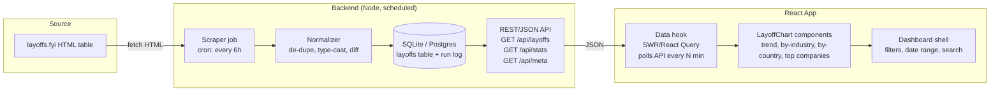

# LayoffChart — Architecture

## 1. Problem shape

**Verified 2026-08-26 by fetching the live page** — this matters because it's not what a
generic "just scrape the table" assumption would guess:

- `layoffs.fyi` exposes one **real, public, unauthenticated JSON API**:
  `GET https://layoffsfyi-production.up.railway.app/api/annual-stats` — returns yearly
  aggregate totals only (`{ years: [{year, employees, companies}], totalEvents,
  totalUniqueCompanies }`). No per-company rows.
- The **per-company detail table** (company, location, industry, headcount, date, stage,
  funds raised) is *not* static HTML — it's an **Airtable embed iframe**
  (`airtable.com/embed/app1PaujS9zxVGUZ4/...`), a client-rendered app on Airtable's own
  domain. A plain HTTP fetch + `cheerio` parse of `layoffs.fyi` will **not** see these rows.
- Other path guesses on their backend (`/api/layoffs`, `/api/records`, `/api/data`) redirect
  to an **internal admin login page** ("Queue Review") — not a public data source, do not
  attempt to access it.
- The site's own footer states data is free to use with attribution.

**Implication for architecture**: two different data sources, two different fetch strategies:

1. **Annual stats** (real API, cheap, reliable): plain `fetch` on a schedule. Use for the
   trend headline numbers immediately.
2. **Per-company rows** (Airtable embed, client-rendered) — **resolved 2026-08-26 via
   Playwright**: the embed's grid is virtualized (only ~40 DOM rows exist at once out of
   ~4,575 total) and columns are keyed by opaque field IDs, so DOM-scraping was ruled out.
   Instead: launch a real (headless) browser once per scrape to capture the exact signed
   request the embed itself makes — `GET https://airtable.com/v0.3/view/{viewId}/
   readSharedViewData` — then **replay that exact request (URL + headers) with a plain
   `fetch()` outside the browser**. This returns the full dataset in one call (verified:
   all 4,575 rows, ~2.9MB JSON) plus the column schema needed to resolve `select`/
   `multiSelect` field IDs to display names (e.g. Industry, Country, Stage). Calling
   `response.json()`/`response.body()` *inside* Playwright on this specific response
   reliably crashed the Chromium renderer during development — replaying outside the
   browser avoided that and is also cheaper (no need to hold the browser open while
   downloading ~3MB). Implementation: `backend/src/scraper/rows.ts`.
   The signed URL's `accessPolicy` carries an `expires` several weeks out, but treat it as
   capture-per-run, not cacheable long-term — it's an undocumented endpoint that could
   change shape or tighten its signing without notice.

Either way, the browser must never hit these sources directly — one backend job fetches on
a schedule, everyone else reads our own cached/normalized copy. This shapes the whole
system: **scraper (2 sources) → normalized store → API → React dashboard**, with the
scraper run on a schedule so the dashboard is "auto-updated" without a human re-running
anything.

## 2. High-level architecture

## 3. Components

### 3.1 Scraper job (backend, Node + cron)
Two collectors, run from the same cron trigger:

- **Stats collector** (cheap, high-reliability): plain `fetch` against
  `layoffsfyi-production.up.railway.app/api/annual-stats`. Powers the yearly headline
  numbers. This one has almost nothing that can go wrong.
- **Rows collector** (per-company detail): launches a headless browser (Playwright) just
  long enough to capture the signed `readSharedViewData` request the Airtable embed makes
  on load, then replays that request with plain `fetch()` outside the browser to pull all
  ~4,575 rows in one call. See §1 for why (DOM virtualization + a renderer crash on
  parsing the response in-browser ruled out the simpler approaches). Implemented and
  verified working end-to-end as of 2026-08-26.

- Runs on a **schedule** (default: every 6 hours) via `node-cron` (or a hosted cron:
  GitHub Actions schedule / Vercel Cron / a small VM cron entry — see §5 for options).
- On each run: parse rows → normalize → **diff against last snapshot** → upsert only
  changed/new rows → write a `scrape_runs` log row (timestamp, row count, status, error,
  and which of the two collectors it came from).
- If the rows collector yields 0 rows or fails a sanity check (e.g. row count drops >50%
  vs last run), the job **aborts the write** and flags `status=failed` rather than
  overwriting good data with garbage. This is the single biggest real-world risk — Airtable
  embed markup or the headless-browser approach breaking silently — see the alerting note
  in §6. The stats collector failing independently should not block the rows collector,
  and vice versa.

### 3.2 Store
- Start with **SQLite** (file-based, zero-ops) for a single-instance deployment;
  swap the DB layer for Postgres if this needs to scale to multiple backend instances.
- Tables:
  - `layoffs(id, company, location_city, location_country, industry, laid_off_count,
    date, stage, funds_raised_m, source_url, first_seen_at, last_seen_at)`
  - `scrape_runs(id, started_at, finished_at, status, rows_scraped, rows_changed, error)`

### 3.3 API (backend)
- `GET /api/layoffs` — paginated/filterable raw rows (query params: date range, industry,
  country, company search).
- `GET /api/stats` — pre-aggregated view for charts: layoffs per month, per industry,
  per country, top N companies by headcount cut. Computed on read (data is small — a few
  tens of thousands of rows at most) or cached for a few minutes.
- `GET /api/meta` — last successful scrape time, row count, source attribution text.
  The frontend uses this to show "Data as of {time}" so users can trust freshness.

### 3.4 Frontend (React)
- **Data layer**: React Query (or SWR) hits the API, revalidates on an interval
  (e.g. every 5 min) and on window focus — this is the "auto-updated" UI behavior;
  the backend cron is what's "auto-updated" underneath it.
- **`LayoffChart` components** (the deliverable named in the request):
  - Trend line: total layoffs per month (stacked/segmented by industry optionally).
  - Bar: top 15 companies by headcount cut, current filter scope.
  - Bar/treemap: layoffs by industry.
  - Map or bar: layoffs by country.
  - Table: raw filtered rows underneath the charts, for drill-down.
- **Dashboard shell**: filter bar (date range, industry, country, company search),
  a "Data as of …" + attribution footer (required, see §1), loading/empty/error states.
- Charting library: Recharts (simplest React-native fit) unless you'd prefer
  something else — flag this as a decision point below.

## 4. Data flow (steady state)

1. Cron fires the scraper on schedule.
2. Scraper parses layoffs.fyi → normalizer diffs vs DB → DB updated → run logged.
3. React app, already open or freshly loaded, polls `/api/stats` and `/api/meta`
   on its own interval.
4. New data appears in charts without a deploy or manual refresh of the pipeline —
   only the browser tab needs to still be open or reloaded, per the polling interval.

## 5. Hosting options (pick one — flagged for your input)

| Piece | Simple option | Notes |
|---|---|---|
| Scraper + API | Single Node service (Express/Fastify) with `node-cron` in-process | One deployable, e.g. Render/Railway/Fly.io/a small VM. Simplest to reason about. |
| Scraper only | GitHub Actions scheduled workflow writes to a hosted DB (Postgres on Neon/Supabase) | No always-on server needed for scraping; still need *something* to serve the API (could be serverless functions reading the same DB). |
| Frontend | Static hosting (Vercel/Netlify) calling the API above | Standard CRA/Vite build. |

Default assumption for the plan below: **one Node backend (Express + node-cron + SQLite)**
serving both the cron job and the API, plus a separate Vite+React frontend — simplest to
develop and run locally, and still trivially deployable as two small services later.

## 6. Risks / open questions

- **Scraper fragility**: layoffs.fyi can change its markup any time; this is the main
  ongoing maintenance cost. Mitigate with the sanity-check-before-write rule above, and
  optionally a webhook/email alert on `scrape_runs.status = failed`.
- **Attribution**: must stay visible on the dashboard per the site's stated terms.
- **Rate/politeness**: keep the poll interval coarse (hours), not real-time.
- **Legal**: this is "free to use with attribution" per the site itself, but no formal
  license is granted — fine for a personal/internal dashboard; revisit before any
  commercial redistribution of the data.
